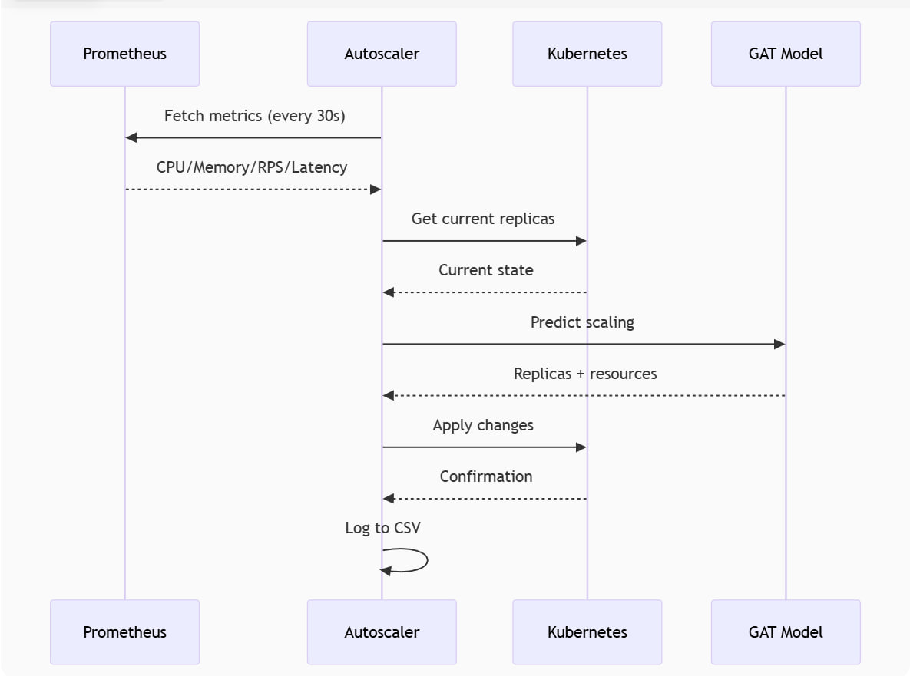

# Kubernetes GAT Autoscaler

This project is an intelligent autoscaler for Kubernetes that uses Graph Attention Networks (GAT) to predict the optimal number of replicas and resources for microservices.

## Solution Architecture

The system consists of:
1. **Metrics Collector** - receives data from Prometheus
2. **GAT Model** - processes the metrics as a service dependency graph
3. **Executor** - applies changes to the Kubernetes cluster
4. **Trainer** - trains the model on historical data

## Features

- **Graph Model** - accounts for dependencies between services
- **Combined scaling** - horizontal (replicas) and vertical (resources)
- **Temporal features** - takes into account hour of day and day of week
- **Attention mechanism** - highlights the most important relationships

## Requirements

- Kubernetes 1.20+
- Prometheus with customized metrics
- Python 3.8+
- PyTorch 1.10+
- torch-geometric

## Installation

1. Install dependencies:
```bash
    pip install -r requirements.txt
```

## Run

2. Run:
``` bash
    python autoscaler.py
```

## Solution Architecture

